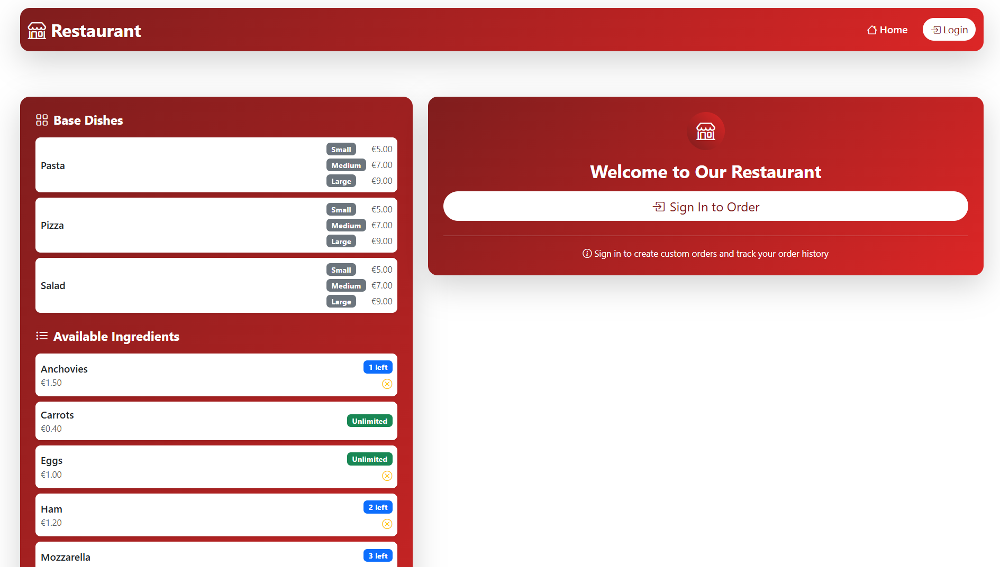
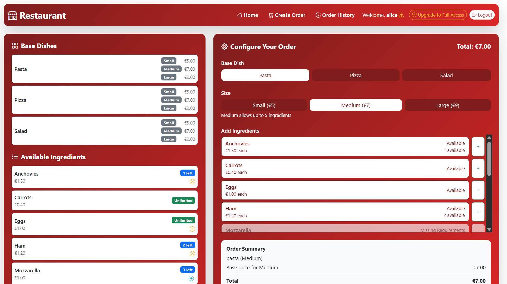
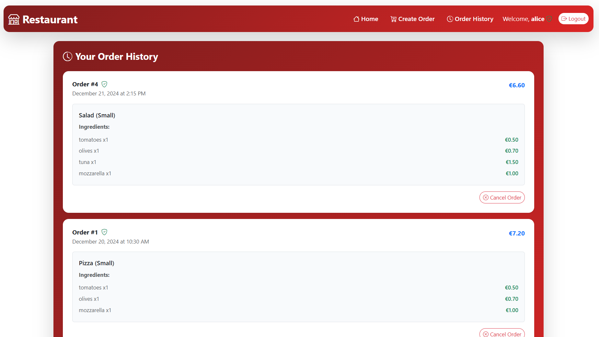
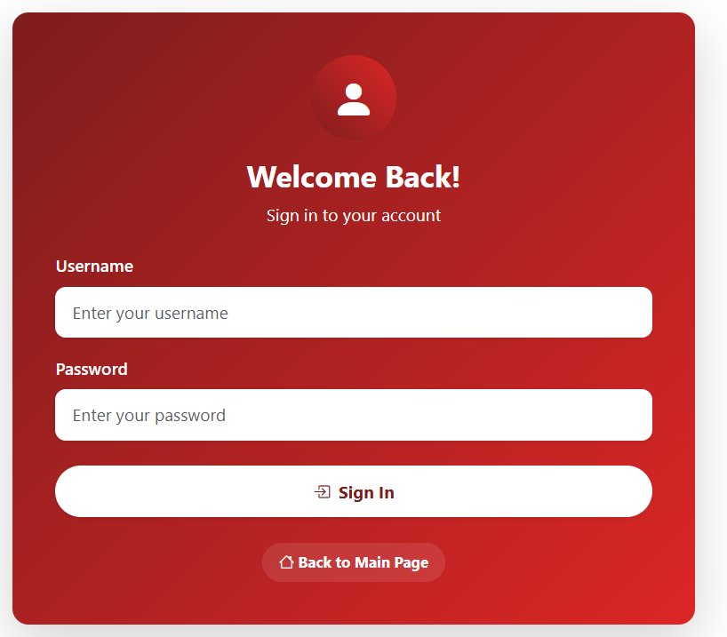
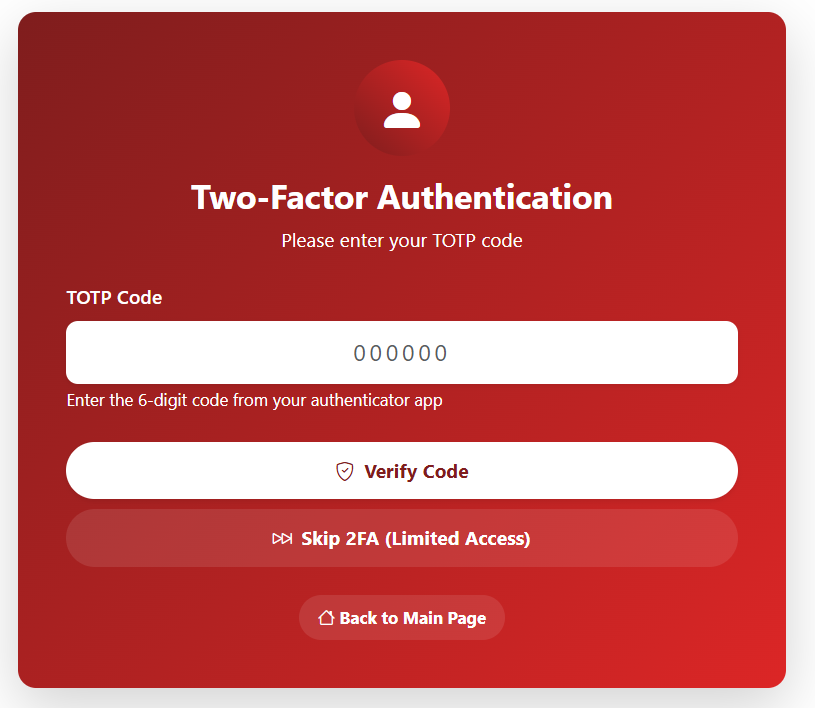

# Exam #2: "Restaurant"
## Student: s343470 SANNA CLAUDIA 

## 1. Server-side

### HTTP APIs

- **GET /api/dishes** - Get all available base dishes
- **GET /api/ingredients** - Get all ingredients with constraints and availability
- **GET /api/pricing** - Get pricing info and size constraints
- **POST /api/validate-order** - Validate order configuration (auth required)
- **POST /api/orders** - Submit new order (auth required)
- **GET /api/orders** - Get user's order history (auth required)
- **DELETE /api/orders/:id** - Cancel order (auth + 2FA required)
- **POST /api/sessions** - User login
- **POST /api/login-totp** - 2FA verification
- **GET /api/sessions/current** - Get current user info
- **DELETE /api/sessions/current** - Logout

### Database Tables

- **Users** - User accounts (id, username, password_hash, salt, totp_secret)
- **Dishes** - Base dishes (id, name) - pizza, pasta, salad
- **Ingredients** - Available ingredients (id, name, price, available_portions)
- **IngredientRequirements** - Ingredient dependencies (ingredient_id, required_ingredient_id)
- **IngredientIncompatibilities** - Ingredient conflicts (ingredient_id, incompatible_with_id)
- **Orders** - Customer orders (id, user_id, dish_id, size, total_price, created_at, used_2fa)
- **DishPricing** - Stores pricing and size constraints for each dish (dish_id, size, base_price, max_ingredients)
- **OrderIngredients** - Ingredients per order item (order_item_id, ingredient_id, quantity)

## 2. Client-side

### Routes

- `/` - Main welcome page with navigation to login or browse menu.
- `/login` - Authentication page with username/password and optional TOTP.
- `/order` - Order configuration page with ingredient selection and constraints.
- `/history` - User's order history with cancellation options (requires 2FA).
- `*` - 404 Not Found page for invalid routes.

### Main React Components

- `App` - Root component managing authentication state and routing.
- `Layout` - Main layout with navigation bar and content area.
- `LoginForm` - Authentication form with regular login and TOTP support.
- `NavigationBar` - Fixed navigation with user info and login/logout.
- `MenuBrowser` - Panel displaying dishes and ingredients with constraints.
- `OrderConfigurator` - Panel for order creation with real-time validation.
- `OrderHistory` - Order management interface with cancellation functionality.

## 3. Overall

### Screenshots
#### Home Page

#### Order Configurator

#### History

#### Login

#### TOTP Verification

## User Accounts

- **Username**: alice | **Password**: pwd
- **Username**: bob | **Password**: pwd 
- **Username**: charlie | **Password**: pwd 
- **Username**: diana | **Password**: pwd

All users can browse and order. Only 2FA users can cancel orders.

